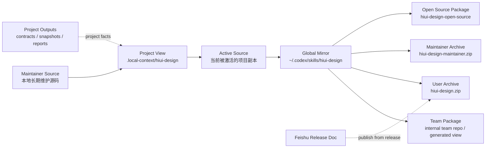

# hiui-design 仓位与流向治理草案

本文档是 `hiui-design` 现有分发规则的汇总草案，用于把“仓位定义、默认落点、同步方向、门禁要求”收口到一处。

这不是新的唯一真相入口。若本文件与下列文件冲突，以它们为准：

- `distribution-manifest.json`
- `docs/onboarding/global-sync-workflow.md`
- `scripts/README.md`
- `scripts/check-distribution-boundary.mjs`
- `scripts/assert-maintainer-source.mjs`

## 1. 官方角色分层

当前规则实际定义的不是“五个平级仓库”，而是“一个维护源 + 多个派生分发表达”。

### 1.0 官方矩阵

| 角色 | 是否源码真相源 | 是否允许长期手改 | 默认生成入口 | 默认校验口径 |
| --- | --- | --- | --- | --- |
| `maintainer source` | 是 | 是 | 维护者直接修改本地源码 | `check-distribution-boundary --scope maintainer` |
| `active source` | 否，属于临时调试源 | 仅调试期可改 | `activate-current-project-global-sync.mjs` | `assert-maintainer-source.mjs` |
| `global mirror` | 否 | 否 | `sync-global-skill.mjs` / launch-agent | `check-distribution-boundary --scope runtime-mirror` |
| `team package` | 否 | 否 | `build-runtime-mirror --target team-package` | `check-distribution-boundary --scope team` |
| `project view` | 否 | 允许随项目接入与页面事实写入变化 | `apply-in-current-project.mjs` | `check-distribution-boundary --scope project` |
| `user archive` | 否 | 否 | `build-skill-archive.mjs` | `check-distribution-boundary --scope team` |
| `maintainer archive` | 否 | 否 | `build-skill-archive.mjs` | maintainer release bundle |
| `open-source package` | 否 | 否 | `sync-open-source-package.mjs` | `check-distribution-boundary --scope open-source-package` |

### 1.1 Maintainer Source

- 角色：本地维护源 / 私有源目录 / maintainer source
- 职责：唯一允许长期维护规则、脚本、文档、模版与发布脚本的本地源码根目录
- 边界：
  - 默认不进 Git，不作为内部团队消费仓
  - 运行 `check-distribution-boundary --scope maintainer` 时，至少要保证本机私有内容不会混入派生分发视图；若当前目录临时位于 Git workspace 中，仍要求这些私有内容不被 Git 跟踪
- 现有规则依据：
  - `scripts/README.md`
  - `distribution-manifest.json`
  - `scripts/check-distribution-boundary.mjs`

### 1.2 Active Source

- 角色：当前调试项目里被激活为机器级同步源的完整 skill 根目录
- 常见形态：`<project-root>/.local-context/hiui-design`
- 职责：在项目里调规则时，作为当前会回流到 `global mirror` 的来源
- 约束：
  - 同一时刻只允许一个 active source
  - 必须先通过 `assert-maintainer-source.mjs`
  - 不完整、旧版、裁剪版 `.local-context/hiui-design` 不得直接激活
- 现有规则依据：
  - `docs/onboarding/global-sync-workflow.md`
  - `scripts/activate-current-project-global-sync.mjs`
  - `scripts/manage-global-sync-launch-agent.mjs`
  - `scripts/assert-maintainer-source.mjs`

### 1.3 Global Mirror / Runtime Mirror

- 角色：机器全局镜像 / runtime-mirror
- 默认地址：`~/.codex/skills/hiui-design`
- 职责：Codex 本机统一运行时落点，以及后续全局 release / team package 构建 / 开源同步的中转根目录
- 约束：
  - 不是默认人工维护仓
  - 不是团队分发 Git 仓
  - 不应被视为长期维护基线
  - 只能由 maintainer source 或 active source 镜像生成
- 现有规则依据：
  - `ROLE.md`
  - `distribution-manifest.json` 的 `runtime-mirror`
  - `scripts/build-runtime-mirror.mjs`

### 1.4 Team Package

- 角色：团队安装视图 / team-facing package
- 含义：面向团队项目安装 `hiui-design` 的裁剪包，不含维护者发布链、global sync 守护和 usage backend
- 注意：
  - 它是一个“分发表达”，但当前治理决定要求内部 Git 只承载这个角色，而不是承载 maintainer source
  - 物理地址应通过 `.distribution-addresses.local.json`、launch-agent 状态或 `--team-target` 指定；常见做法是与开源仓同级放置
  - `check-distribution-boundary --scope team` 适用于 user zip、team-facing Git view、internal team repo
- 现有规则依据：
  - `distribution-manifest.json` 的 `team-package`
  - `scripts/check-distribution-boundary.mjs`
  - `scripts/build-runtime-mirror.mjs`

### 1.5 Project View

- 角色：目标项目内的 `.local-context/hiui-design`
- 职责：
  - 为项目提供本地脚本、规则、模板、解释层文档和参考资产
  - 保存项目级 outputs，作为 page contract / snapshot / doctor / gate 的项目事实源
- 注意：
  - 这是项目视图，不等于 team-package
  - `project` scope 允许保留项目 outputs
  - `reference/` 只承载参考资产；若需要 Agent / 维护者解释层，应落到 `docs/generation/explainers/`，不要再恢复顶层 `references/`
- 现有规则依据：
  - `docs/onboarding/global-sync-workflow.md`
  - `scripts/check-distribution-boundary.mjs`
  - `rules/page-task-lifecycle.md`

### 1.6 User Archive / Maintainer Archive

- 角色：
  - `hiui-design.zip`：对外用户包
  - `hiui-design-maintainer.zip`：维护者全量包
- 默认输出地址：`outputs/archives/`
- 约束：
  - user zip 必须裁掉 maintainer-only 文件、全局同步文档和本地运行产物
  - 两份 zip 都要排除 `outputs/` 运行态和本地发布凭证文件
- 现有规则依据：
  - `scripts/build-skill-archive.mjs`
  - `scripts/lib/distribution-rules.mjs`
  - `scripts/README.md`

### 1.7 Open Source Package

- 角色：开源裁剪分发表达 / open-source-package
- 默认目标地址：`~/.codex/skills/hiui-design-open-source`
- 职责：生成去掉私有发布链、usage backend、维护后台、业务线内文档后的公开分发包
- 注意：
  - 规则只写了默认目标地址和裁剪规则
  - 实际 Git 仓可通过 `--open-source-target` 或 `sync-open-source-package.mjs --target` 覆盖
- 现有规则依据：
  - `distribution-manifest.json` 的 `open-source-package`
  - `scripts/sync-open-source-package.mjs`
  - `scripts/manage-global-sync-launch-agent.mjs`
  - `scripts/sync-global-skill.mjs`

## 2. 默认落点与本地覆写

下表区分“规则默认值”和“本地 override / 命令实参”。分发文档不再写死维护者机器绝对路径；若本机存在固定仓位，应写入 `.distribution-addresses.local.json`，或以命令参数和 `status` 输出为准。

| 角色 | 规则默认地址 | 本地 override / 示例占位 |
| --- | --- | --- |
| Maintainer Source | 无写死默认值 | `<maintainer-source-root>` |
| Active Source | 当前项目的 `.local-context/hiui-design` | `<active-project-root>/.local-context/hiui-design` |
| Global Mirror | `~/.codex/skills/hiui-design` | `<home>/.codex/skills/hiui-design` |
| Team Package | 无分发层写死默认值 | `<team-package-root>` |
| Project View | `<project-root>/.local-context/hiui-design` | `<project-root>/.local-context/hiui-design` |
| User Archive | `<skill-root>/outputs/archives/hiui-design.zip` | `<maintainer-source-root>/outputs/archives/hiui-design.zip` |
| Maintainer Archive | `<skill-root>/outputs/archives/hiui-design-maintainer.zip` | `<maintainer-source-root>/outputs/archives/hiui-design-maintainer.zip` |
| Open Source Package | `~/.codex/skills/hiui-design-open-source` | `<open-source-package-root>` |

## 3. 官方同步主链

当前治理应收敛为：

`本地 maintainer source -> 调试项目 .local-context/hiui-design -> 激活为 active source -> 回流 ~/.codex/skills/hiui-design -> 生成 team package / archives / open-source package`

### 3.0 官方流向图

图中有两个容易混淆的点：

- `project view` 和 `active source` 常常是同一个物理目录，但不是同一个治理角色
- `global mirror` 是统一运行时落点和发布中转，不自动升级为“源码真相源”
- internal Git 若存在，应该承载 `team package`，而不是 `maintainer source`

### 3.1 项目侧准备

1. 在目标项目里执行 `activate-current-project-global-sync.mjs`
2. 脚本会先把 source skill 根目录镜像到目标项目 `.local-context/hiui-design`
3. 再执行 `apply-in-current-project.mjs`
4. 再对目标项目本地 skill 执行 `assert-maintainer-source.mjs`
5. 最后执行项目本地的 `manage-global-sync-launch-agent.mjs activate`

这条路径的目的是先把项目本地 skill 拉平到完整、版本对齐、可作为 active source 的状态，再注册成机器级同步源。

### 3.2 Active Source 回流全局

`manage-global-sync-launch-agent.mjs` 会把当前项目的 `.local-context/hiui-design` 注册到 `launchd`，并让 `sync-global-skill.mjs --watch` 常驻运行。

`sync-global-skill.mjs` 的默认一轮同步顺序是：

1. 检查 i18n template boundary
2. 本地 sync hiui-v5 manifest / quick reference / component map / docs / validation
3. 在 source 项目侧执行 `release-skill-archive --no-feishu-remote`
4. 把 source 镜像到 `~/.codex/skills/hiui-design`
5. 在 global mirror 侧执行完整 `release-skill-archive`
6. 从 global mirror 生成 `team package`
7. 把 `team package` 发布到 internal team repo（若内部 Git 分发已启用）
8. 可选执行 open-source package sync

说明：

- 当前脚本实现仍保留把 `global mirror` 直接 `git push` 的兼容能力，但这不再是官方治理口径
- 在“维护源不进 Git、团队不可见维护侧文件”的前提下，internal Git 应承接 `team package`，而不是承接 `global mirror`

### 3.3 发布与外部分发

`release-skill-archive.mjs` 是维护者发布总入口。它负责：

1. 维护者回归与覆盖校验
2. `check-distribution-boundary --scope maintainer`
3. 构建 user zip 与 maintainer zip
4. 回写 `outputs/RELEASE_REPORT.md`
5. 回写 changelog
6. 生成飞书发布稿源
7. 在鉴权存在时上传 `user archive` 并发布飞书正文

### 3.4 内部分发

官方治理上，内部 Git 应只承载 `team package`：

- `maintainer source` 不进 Git
- `global mirror` 只是本机运行时中转，不直接作为团队仓
- internal team repo 必须只包含通过 `check-distribution-boundary --scope team` 的内容

当前规则已具备 `team-package` 视图、边界校验，以及 `sync-team-package.mjs` / `sync-global-skill.mjs --team-target` 这两条生成入口。若维护者机器需要固定 internal team repo 目录，应把该路径登记在 `.distribution-addresses.local.json`，而不是写回可分发文档。

### 3.5 开源同步

全局同步链不会直接“手改开源仓”，而是通过 `sync-open-source-package.mjs` 从 `global mirror` 生成开源分发表达。

默认行为：

- `sync-global-skill.mjs` 会把 global mirror 作为 `--source`
- 若 `--open-source-target` 指向存在的目标目录，则继续同步
- 默认 target 是 `~/.codex/skills/hiui-design-open-source`
- 可选携带 `--open-source-commit` / `--open-source-push`

## 4. 现有规则已经明确的边界

### 4.1 只有 Maintainer Source 可以长期手改

- `runtime-mirror`、`team-package`、`open-source-package` 都声明了 `manualEditsAllowed: false`
- `build-runtime-mirror.mjs` 生成物会写入 `GENERATED_DO_NOT_EDIT.md`

治理要求：

- maintainer source 只在本地维护，不上传 Git 作为团队消费仓
- 不把 global mirror 当维护基线
- 不在派生目标上长期手工修补
- 如需保留修复，必须回写 maintainer source

### 4.2 Active Source 必须是完整 skill 根目录

`assert-maintainer-source.mjs` 明确要求至少存在：

- `SKILL.md`
- `rules/VERSION`
- `agents/openai.yaml`
- `examples/host-integration/src`
- `reference/host-integration/src`
- `templates/i18n`
- `templates/project-images` 最小图片接线骨架
- `scripts/manage-global-sync-launch-agent.mjs`
- `scripts/sync-global-skill.mjs`

治理要求：

- 项目里的 `.local-context/hiui-design` 只能在“完整且版本对齐”时晋升为 active source
- 旧快照、裁剪版、副本残件不得直接接管全局

### 4.3 Project View 和 Team Package 必须分开理解

当前规则已经把两者拆开：

- `team`：用于 user zip、team-facing Git view
- `project`：用于目标项目 `.local-context/hiui-design`，允许 outputs 作为项目事实存在

治理要求：

- 不再把项目内 `.local-context/hiui-design` 直接称为“team-package”
- 面向团队安装分发时，必须使用 `team` scope 校验
- 面向项目内运行时，必须使用 `project` scope 校验

### 4.4 Global Mirror 不是默认维护仓

`ROLE.md` 已明确：

- 这里不是默认人工维护仓
- 这里的修改不应视为维护基线
- 需要长期保留的修改必须回到维护源仓

治理要求：

- 禁止“先在 global mirror 修，再找机会补回源仓”的长期做法
- global mirror 只能作为机器统一运行时落点和后续发布中转
- 不再把 global mirror 直接定义成 internal Git 团队仓

### 4.5 Team Package 才是内部 Git 角色

在“维护源不进 Git、团队不可见维护侧文件”的前提下，内部 Git 只能承载 `team package`：

- internal team repo 必须由 maintainer source / active source 经过 global mirror 派生生成
- internal team repo 必须过 `check-distribution-boundary --scope team`
- 不接受把 maintainer source 或 global mirror 原样暴露给团队

### 4.6 Open Source Package 必须是裁剪表达

现有规则已经要求开源包裁掉：

- usage stats 文档与后端脚本
- global sync / launch-agent / release / Feishu 脚本
- business-line 文档和示例
- vendor 与私有配置

治理要求：

- 开源仓只能由 `sync-open-source-package.mjs` 生成
- 不接受手工补回内部能力
- 开源同步前必须 review 生成 diff

## 5. 建议收口成的治理规则

下面这些是基于现有规则整理出的治理要求，目的是减少概念漂移，不改当前主链。

### 5.1 统一术语

后续文档和口头沟通建议统一使用下面术语：

- `maintainer source`
- `active source`
- `global mirror`
- `team package`
- `project view`
- `user archive`
- `maintainer archive`
- `open-source package`

避免继续用过于模糊的说法：

- “内部仓”
- “全局仓”
- “那份对外包”
- “项目里的那份 skill”

### 5.1.1 建议替换表

| 模糊称呼 | 建议替换成 |
| --- | --- |
| 内部仓 | `team package` 或 `internal team repo` |
| 全局仓 | `global mirror` |
| 全局技能目录 | `global mirror` |
| 项目里的 skill | `project view` 或 `active source` |
| 对外 zip | `user archive` |
| 维护包 | `maintainer archive` |
| 开源仓 | `open-source package` 或开源 Git 仓 |

### 5.1.2 现有混用盘点（首批）

下表只盘点当前规则里最容易导致误解的首批入口文件，方便后续逐步清理口径。

| 文件 | 当前常见说法 | 更准确的治理含义 | 建议动作 |
| --- | --- | --- | --- |
| `docs/onboarding/global-sync-workflow.md` | “全局目录”“全局 skill” | `global mirror`，即机器统一运行时落点与发布中转目录 | 文档首屏保留路径说明，但首次出现时补标准角色名 |
| `scripts/README.md` | “全局 skill 镜像”“全局 skill 目录” | `global mirror` | 发布 / 同步脚本说明里统一先写标准角色名，再补路径 |
| `scripts/README.md` | “`--scope team` 用于 user zip、团队 Git 镜像或目标 `.local-context/hiui-design`” | `team` 与 `project` 是两个不同 scope；目标 `.local-context/hiui-design` 应归 `project view`；内部 Git 只应承载 `team package` | 优先修正文案，避免把 `project view` 继续归入 `team` |
| `CHANGELOG.md`、`scripts/sync-changelog.mjs`、`scripts/sync-feishu-release-doc.mjs` | “对外归档”“最新 zip 包” | 面向发布对象时可以保留 user-facing 说法；治理语境里应对应 `user archive` | 发布稿可继续保留“zip 包”展示词，但治理文档与脚本说明应补 canonical role |
| 口头沟通 / issue / TODO | “内部仓”“项目里的 skill”“开源仓” | 分别应优先指向 `team package` / `internal team repo`、`project view` / `active source`、`open-source package` | 后续评审、故障单与发布记录中优先改用标准角色名 |

### 5.2 统一方向

统一认定派生方向为：

`maintainer source / active source -> global mirror -> team package / archives / optional open-source package`

不要再允许以下反向理解：

- 把 maintainer source 当内部 Git 团队仓
- 把 global mirror 当长期主仓
- 把 project view 当 team package
- 把 open-source repo 当规则真相源

### 5.3 统一地址登记

当前已补一份机器可读草案：

- `distribution-addresses.json`

它是支持性登记文件，不替代：

- `distribution-manifest.json`
- `docs/onboarding/global-sync-workflow.md`
- `scripts/README.md`

当前草案至少记录：

- maintainer source 根目录
- global mirror 根目录
- open-source target 根目录
- 当前 active source
- user archive 输出目录
- maintainer archive 输出目录

这样可以减少“脚本默认值”和“本机实际仓位”长期漂移。

### 5.4 统一门禁

建议把以下检查设为固定门禁：

1. active source 激活前必须过 `assert-maintainer-source`
2. maintainer source 发布前必须过 `check-distribution-boundary --scope maintainer`
3. team-facing 产物必须过 `check-distribution-boundary --scope team`
4. internal team repo 入库前必须确认来源是 `team package`，而不是 maintainer source / global mirror
5. project view 验收时必须按 `--scope project`
6. open-source package 发布前必须过 `--scope open-source-package`

补充说明：

- `team` 和 `project` 不能混用
- `project` 允许保留项目 outputs 作为页面事实
- `team` 不允许把维护现场、usage 文档和项目运行态混进交付视图

### 5.5 统一发布闭环

建议认定以下四项必须属于同一轮发布闭环：

1. `outputs/archives/hiui-design.zip`
2. `outputs/archives/hiui-design-maintainer.zip`
3. `outputs/RELEASE_REPORT.md`
4. `outputs/FEISHU_RELEASE_DOC_STATE.json`

若四者不一致，应视为“发布未完成”，而不是“只有状态文件没更新”。

### 5.6 统一测试与回归证明

现有规则已经把分发边界的一部分写进测试：

- `scripts/tests/distribution-manifest.test.mjs`
- `scripts/tests/build-runtime-mirror.test.mjs`

治理上建议把下面几项视为“仓位治理回归证明”：

1. `validate-distribution-manifest.mjs --json`
2. `check-distribution-boundary.mjs --scope maintainer --strict --json`
3. `build-runtime-mirror.mjs --target runtime-mirror --json`
4. `build-runtime-mirror.mjs --target team-package --json`
5. `build-runtime-mirror.mjs --target open-source-package --json`
6. `sync-open-source-package.mjs --target <repo>` 生成 diff 审阅

### 5.7 落地动作清单

若要把当前规则真正治理稳，建议按以下顺序落地：

1. 确认 maintainer source 的唯一工作根目录，并在团队内固定口径。
2. 明确 maintainer source 为本地目录，不再把它作为 Git 仓口径传播。
3. 如 team package internal team repo 地址发生迁移，及时更新 `distribution-addresses.json`、本文件和常用命令示例。
4. 固定 open-source package 的正式 Git 目标地址，避免长期依赖脚本默认值与人工记忆。
5. 新增机器可读地址注册文件，例如 `distribution-addresses.json`。
6. 在发布前 CI 或 maintainer self-check 中加入 `team / runtime-mirror / open-source-package` 的严格边界校验。
7. 统一术语，把“内部仓”“全局仓”等模糊说法逐步替换成标准角色名。
8. 对所有常用入口文档补链到本文件，降低维护者口口相传造成的漂移。

### 5.8 不建议的治理做法

- 不要把 maintainer source 放进 Git 并直接分发给团队。
- 不要把 global mirror 上的临时修补长期留存而不回写 maintainer source。
- 不要把 project view 直接当作 team package 交付给其他项目。
- 不要让多个项目的 `.local-context/hiui-design` 并发回流同一个 global mirror。
- 不要让开源仓手工演进出内部仓没有的规则事实。
- 不要在发布链之外单独重建 zip、状态文件和开源仓，然后默认它们仍然属于同一轮发布。

## 6. 这份草案不改动的现有事实

本草案不试图改变以下既有设计：

- 允许项目 `.local-context/hiui-design` 临时成为 active source
- 允许 global mirror 在同步后继续执行全局 release
- 允许 open-source target 通过 CLI 参数覆盖默认地址
- 允许 project view 保留 outputs 作为项目事实源

本草案只做一件事：把现有规则里已经存在、但分散在多处的角色和流向定义收拢，减少口径漂移。
