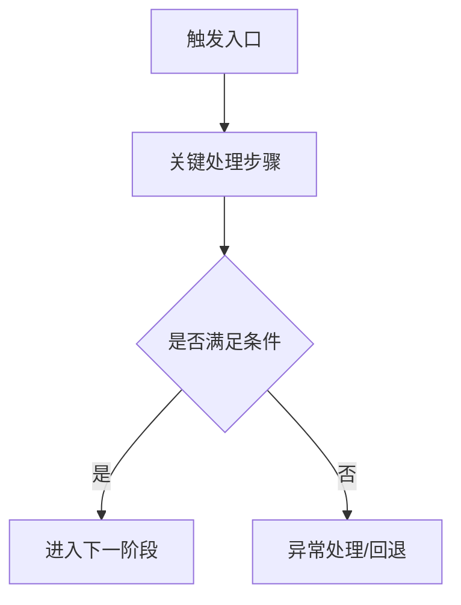
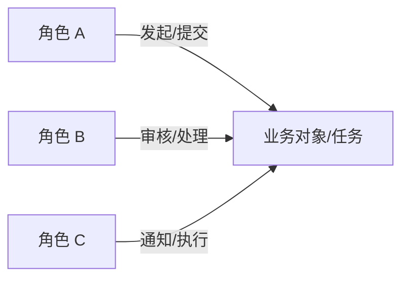
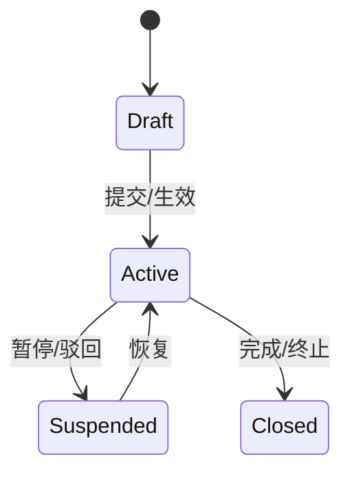
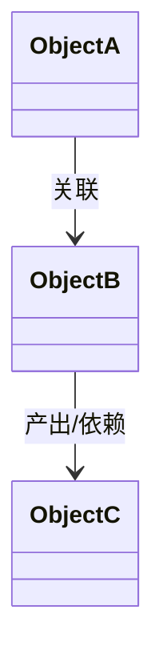

# 产品 PRD 模板

当用户要求正式 PRD、需求文档、评审稿、产品文档或在线协作文档时，使用本模板组织输出。该模板面向人审，不包含页面级提示词、HiUI 交接包或机器执行细节。

## Table of Contents

- [使用规则](#使用规则)
- [推荐输出渠道](#推荐输出渠道)
- [PRD 结构](#prd-结构)

## 使用规则

- 保留需求细化阶段已经确认的事实，并显式标注假设与待确认项。
- 若仍存在高影响 `remainingDebt`，文档状态应写为“草稿 / 待确认版本 / 评审稿”，不得写成“已确认”。
- 背景首句优先回答“为什么现在做”；目标优先写成“当前值 -> 目标值 -> 时间范围”。
- 功能描述优先使用“触发条件 -> 处理逻辑 -> 输出结果”。
- 验收标准尽量可判断通过/不通过，避免“更高效”“体验更好”之类模糊表述。
- 页面清单只保留产品层信息；不要把页面级提示词、HiUI 页型建议、机器计划或 gate 状态混入正文。
- 当需求包含跨角色协作、阶段流转、审批/交接、回退/异常分支、多对象关联中的任意一种复杂性时，PRD 应补充图示，而不是只靠文字和表格。
- 图示仍属于产品层信息，允许出现在 PRD 正文；但图中不得混入页面级提示词、HiUI handoff、机器计划或 gate 细节。
- 图示与正文中的角色名、状态名、对象名、终态/异常态命名必须一致；若异常表中出现“阻塞中”“取消中”这类概念，需要显式说明它是主状态、子状态、标签还是仅记录字段，不能让流程图、状态图和规则表各写一套名字。
- 当角色边界复杂、编辑权限差异明显或容易出现越权理解偏差时，PRD 建议补充权限矩阵，而不只保留“用户角色”文字描述。
- 当生命周期复杂、状态迁移依赖条件较多或需要明确“当前状态 -> 触发动作 -> 下一状态 -> 角色限制”时，PRD 建议补充状态流转表，而不只保留状态图。
- 推荐优先使用 Mermaid：
  - 主流程 / 审批流 / 分支流：`flowchart`
  - 状态机 / 生命周期：`stateDiagram-v2`
  - 角色协同 / 责任分工：`flowchart` 或带角色泳道的分组图
  - 对象关系 / 实体关系：`classDiagram` 或简化关系图
- 若需求较轻，图示可选；若缺少图示会明显增加评审理解成本，图示应视为必填而不是附加项。

## 推荐输出渠道

在选择输出渠道前，先执行以下协议：

- `hasFeishuDocCapability`：仅当当前宿主环境在本轮真实提供协作文档创建能力（例如飞书），且当前交付模式包含 `product-prd` 时，返回 `true`
- `onFeishuWriteFailure = fallbackToMarkdown`：协作文档写入失败、权限不足或返回异常时，自动回退为独立 Markdown PRD 文档
- `messageReturnFormat = title + link_or_path + short_summary`：无论最终产物落在在线协作文档还是本地文件，对话里都统一返回标题、链接或文件路径，以及 2-4 行摘要
- 若当前交付模式包含 `product-prd`，PRD 必须产出文档载体；摘要只能作为导览，不得替代文档链接或路径

- 若宿主环境提供协作文档创建能力（例如飞书），优先生成在线协作文档。
- 若无协作文档工具或协作文档写入失败，默认生成独立 Markdown PRD 文档，并在消息中返回摘要与文件路径。
- 仅在文档产物已经生成的前提下，才允许额外在消息中补充短摘录；不得用内联正文替代产物。
- 若同时需要页面生成输入，请将 PRD 与提示词/交接包分开展示或分开存放。

## PRD 结构

```markdown
# <产品/需求名称> PRD

## 0. 文档信息

| 字段 | 内容 |
|---|---|
| 文档标题 |  |
| 版本 | V1.0 |
| 作者 |  |
| 创建日期 | YYYY-MM-DD |
| 最后更新 | YYYY-MM-DD |
| 状态 | 草稿 / 待确认 / 评审中 / 已确认 |
| 关联需求/任务 |  |

## 1. 背景与目标

### 1.1 业务背景
- 为什么现在做：
- 当前现状：
- 影响范围：

### 1.2 目标
- 业务目标：
- 产品目标：
- 非目标（Out of Scope）：

## 2. 用户与场景

### 2.1 用户角色
| 角色 | 入口 | 核心诉求 | 权限差异 |
|---|---|---|---|
|  |  |  |  |

### 2.2 核心场景
| 场景 ID | 场景名称 | 触发条件 | 成功结果 | 优先级 |
|---|---|---|---|---|
| S01 |  |  |  | P0 |

### 2.3 关键流程图（按需，但复杂流程建议必填）



### 2.4 角色协作/责任关系图（按需）



### 2.5 权限矩阵（角色边界复杂时建议补充）

| 角色 | 可查看 | 可创建 | 可编辑 | 可审批/推进 | 可删除/撤回 | 限制说明 |
|---|---|---|---|---|---|---|
|  |  |  |  |  |  |  |

## 3. 核心功能需求

### F01 <功能名称>
- 触发条件：
- 处理逻辑：
- 输出结果：

## 4. 业务规则

| 规则 ID | 规则名称 | 适用范围 | 规则说明 | 异常/失败反馈 |
|---|---|---|---|---|
| R01 |  |  |  |  |

### 4.1 状态流转图（涉及生命周期/审批流时建议必填）



### 4.2 状态流转表（状态条件复杂时建议补充）

| 对象 | 当前状态 | 触发动作 | 下一状态 | 可操作角色 | 校验/限制 | 反馈/通知 |
|---|---|---|---|---|---|---|
|  |  |  |  |  |  |  |

## 5. 异常流程

| 异常场景 | 触发条件 | 处理方式 | 通知对象/反馈 |
|---|---|---|---|
|  |  |  |  |

## 6. 页面清单

| 页面 ID | 页面名称 | 工作面类型 | 路由/位置 | 用户目标 | 入口/出口 | 关键状态 | 优先级 |
|---|---|---|---|---|---|---|---|
| P01 |  | page/modal/drawer/... |  |  |  | 默认/空/加载/错误/无权限/成功 | P0 |

## 7. 依赖与风险

### 7.1 依赖
| 依赖项 | 类型 | 说明 | 状态 |
|---|---|---|---|
|  | 系统/接口/数据/团队 |  |  |

### 7.2 风险与假设
| 类型 | 内容 | 影响 | 应对方式 |
|---|---|---|---|
| 风险/假设/待确认 |  |  |  |

## 8. 关键对象关系图（按需，涉及多对象协作时建议补充）



## 9. 验收标准

| 场景/能力 | 输入或前置条件 | 预期结果 | 通过标准 |
|---|---|---|---|
|  |  |  |  |

## 10. 待确认项与下一步

- 当前待确认：
- 推荐下一步：
```
