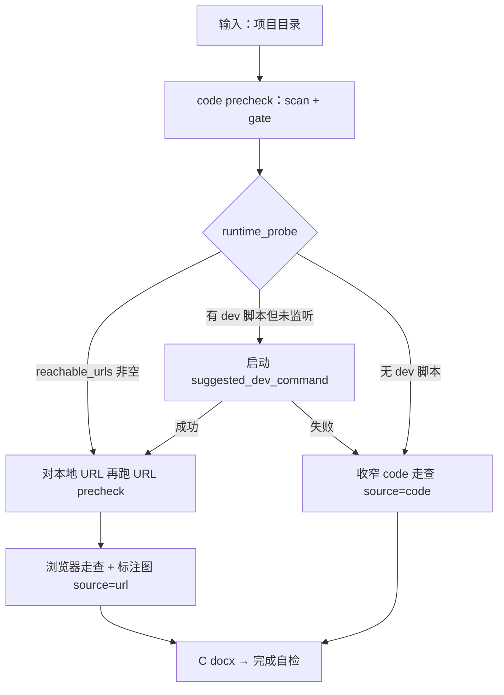

# 代码走查

## 适用场景

当用户提供的是本地前端项目目录，且目录中可识别到 `package.json`、`src/`、路由文件或页面组件时，使用本模式。

## 运行时优先（体验混合走查）

code 模式**不能看见**页面渲染结果，只能推断。为贴近「体验走查」目标，**gate 通过后优先尝试运行时验证**：



### precheck 返回的 runtime 分支

读 `precheck_walkthrough.py` 的 `runtime_probe` 与（可能被改写的）`next_action`：

| `next_action` | 含义 | 阶段 B |
|---------------|------|--------|
| `try_url_walkthrough` | 本地 dev 已在跑 | 对 `reachable_urls[0]` 做 URL precheck + 浏览器走查 |
| `start_dev_server_then_url_walkthrough` | 有 dev 脚本但未探测到服务 | Agent 启动 dev；成功 → URL 走查 |
| `fallback_code_walkthrough` | 无 dev 脚本或启动失败 | 收窄 code 走查 |

单独调试探测：

```bash
python3 {SKILL_DIR}/scripts/probe_dev_server.py <项目路径> --json
python3 {SKILL_DIR}/scripts/probe_dev_server.py <项目路径> --url http://localhost:3000 --json
```

**注意：** 本脚本默认**只探测**常见 localhost 端口，不在脚本内长时间挂起启动 dev。

### 启动成功 → 按 URL 模式交付

```bash
python3 {SKILL_DIR}/scripts/precheck_walkthrough.py "http://localhost:3000/..." --json
```

- 浏览器打开业务页（需登录则先登录）
- 确定问题须截图 + **标注图** + bbox（url 模式强制）
- `report.json` → **`source: "url"`**
- 走查重点：**看得见的体验**（布局、反馈、空态、主操作）

### 启动失败 → 收窄 code 走查

- `report.json` → **`source: "code"`**
- 附录：**未启动项目，结论基于代码推断**
- 只强报 code 能确定的体验问题
- i18n / design token / 响应式 → **不报或标「待启动后验证」**

## 体验边界

| 类别 | 启动成功（URL 分支） | fallback code |
|------|---------------------|---------------|
| 能否「看见」页面 | ✅ | ❌ 只能推断 |
| 是否要标注图 | ✅ 必须 | ❌ 可不配图 |
| 适合报的问题 | 视觉、交互、真实空态/错态 | 逻辑缺口、明显无兜底 |
| 不适合报的 | 纯代码 i18n/token（除非页面上已混语） | 色值、小屏、密度（标待验证） |

**可强报（code 可确定）：**

- 主流程逻辑缺口（如无提交入口、关键步骤被 `return null` 截断）
- 无 loading / error / empty 分支且会导致用户困惑
- 明显无错误恢复路径

**降级或标「待启动后验证」：**

- i18n key 与硬编码混用（未见渲染结果）
- design token 与硬编码色值（深色主题是否异常需跑页面）
- 响应式、小屏表格横滚、真实内容密度与截断

## 本模式门禁

- 优先运行 `scripts/precheck_walkthrough.py <项目路径> --json`
- 优先读取 `precheck_walkthrough.py` 返回的 `next_action` 与 `runtime_probe`
- 至少能运行扫描脚本，或能手动识别核心页面与结构
- 若项目不可读或结构无法判断，不进入完整交付
- 若结构化判断结果显示仓库不是页面项目，不进入完整交付，交给统一完成判断判定层

## 证据采集

优先做两件事：

1. 先用统一前置检查脚本确认这是页面项目并完成扫描门禁
2. 按 runtime 分支决定 URL 走查或收窄 code 走查

首选命令：

```bash
python3 {SKILL_DIR}/scripts/precheck_walkthrough.py <项目路径> --json
```

若只需要拆开单独调试，再分别使用下面两个底层脚本：

首选命令：

```bash
python3 {SKILL_DIR}/scripts/detect_input_mode.py <项目路径> --json
```

首选命令：

```bash
python3 {SKILL_DIR}/scripts/scan-pages.py <项目路径>
```

完成扫描后，立即运行：

```bash
python3 {SKILL_DIR}/scripts/check_evidence_gate.py --source code --scan-json <扫描结果JSON> --json
```

优先读取返回里的 `next_action`，不要再靠中文消息自行判断是继续走查、补证据还是进入统一完成判断判定。

重点保留：

- 技术栈
- 路由文件
- 页面组件
- 样式文件
- 通用组件

若脚本不可用，不中断任务，改为手动扫描：

1. 读取 `package.json`
2. 查找路由配置
3. 列出页面级组件
4. 列出样式文件
5. 识别通用组件和高频交互模块

若 `detect_input_mode.py` 已明确给出：

- `status=failed`
- `failure_preset=code_not_page_project`

则当前仓库不应继续按页面项目走查，应直接说明失败原因，并等待用户补充可执行输入。

若 `check_evidence_gate.py` 已明确给出：

- `status=failed`
- `failure_preset=code_scan_failed`

则说明当前扫描结果不足或扫描失败，且尚无可替代的手动证据，不应继续进入正式代码走查，应直接说明失败原因，并等待用户补充可执行输入。

## 问题判断重点

以下仅为代码走查的额外关注点。正式问题判断时，仍需结合 `ux-checklist.md` 与命中条目 `related_examples` 指向的 `issue-examples/*` 锚点执行。

- 主流程是否完整
- 页面层级是否清楚
- 高频操作是否顺手
- 状态反馈是否充分
- 文案是否面向业务
- 样式是否一致
- 是否存在明显重复劳动或错误恢复困难

## 交付门禁

- 每个问题尽量落到具体位置：页面、文件、组件、函数、状态变量
- 若证据只来自代码推断，必须明确写出“基于代码推断，建议结合实际页面确认”
- URL 分支须满足 url 模式标注图门禁；code 分支可无图，也仍需生成本地 `.docx`

## `report.json` 组织建议

- 启动成功走 URL 时 `source` 写 `url`；否则写 `code`
- `scope` 建议写成：`项目路径 + 走查模块`，例如 `src/pages/order + 结算主流程`
- `tech_stack` 建议显式写入
- `issues[].location` 优先写页面、文件、组件或函数定位
- `issues[].evidence_note` 若结论主要来自代码推断，建议固定包含“基于代码推断，建议结合实际页面确认”
- `issues[].images`：url 分支必填标注图；code 分支允许为空数组
- 若全篇无图，附录说明建议写“本次报告无截图证据，结论主要基于代码结构与交互逻辑推断；未启动项目”

## 记为一次完整使用的条件

- 已形成完整报告
- 已生成本地 `.docx`
- `--source` 与 `report.json.source` 一致（`url` 或 `code`）
- 若结论主要来自代码推断，仍可记一次 `source=code` 使用，但报告中必须明确提示“建议结合实际页面确认”
- 若当前只是还在补仓库信息、补页面入口或补扫描证据，属于 `needs_input`，暂不完成判断
- 若已确认仓库不是页面项目、代码扫描失败且无法补足，应说明失败原因和下一步，不要输出完整报告
- 具体完成判断按 `SKILL.md` 完成定义执行
